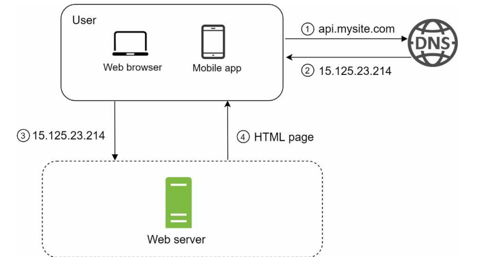

# system-design
# Singleserversetup:

1. Users access websites through domain names, such as api.mysite.com. Usually, the
Domain Name System (DNS) is a paid service provided by 3rd parties and not hosted by
our servers.
2. Internet Protocol (IP) address is returned to the browser or mobile app. In the example,
IP address 15.125.23.214 is returned.
3. Once the IP address is obtained, Hypertext Transfer Protocol (HTTP) [1] requests are
sent directly to your web server.
4. The web server returns HTML pages or JSON response for rendering.
# Database
With the growth of the user base, one server is not enough, and we need multiple servers: one
for web/mobile traffic, the other for the database (Figure 1-3). Separating web/mobile traffic
(web tier) and database (data tier) servers allows them to be scaled independently.
1)  Data-tier ==> where the information that is processed by the application is stored and managed. 
## Which databases to use?
You can choose between a traditional relational database and a non-relational database. Let
us examine their differences.
1) Relational databases are also called a relational database management system (RDBMS).SQL DB
• store data in tables and rows
2) Non-Relational databases are also called NoSQL databases. Popular ones are CouchDB,
Neo4j, Cassandra, HBase, Amazon DynamoDB, etc. [2]. These databases are grouped into
four categories: key-value stores, graph stores, column stores, and document stores. Join
operations are generally not supported in non-relational databases.
• Your data are unstructured, or you do not have any relational data.
• You only need to serialize and deserialize data (JSON, XML, YAML, etc.).
• You need to store a massive(large) amount of data.
# Vertical Scaling & Horizontal Scaling:
Vertical scaling (or "scaling up") and horizontal scaling (or "scaling out") are two approaches to improve system capacity and performance. Here’s a breakdown of the two methods:
1. Vertical Scaling (Scaling Up)
*Definition: Increasing the power of a single server or machine by adding more resources (CPU, RAM, storage, etc.).
* Example: Upgrading from a 16 GB RAM, 4-core machine to a 64 GB RAM, 16-core machine.
* Pros:
1) Simpler to implement since you’re just upgrading a single machine.
2) Can be cost-effective for smaller applications and workloads.
3) Easier to manage since there’s only one instance to configure and maintain.
* Cons:
1) Limited by the maximum capacity of the hardware. There’s a ceiling to how much a single machine can scale.
2)  higher cost for powerful hardware.
3) Single point of failure: If the machine goes down, the application becomes unavailable.

2. Horizontal Scaling (Scaling Out)
* Definition: Adding more machines to distribute the workload across multiple servers.
* Example: Adding additional servers to handle the traffic in a web application or distributing database queries across replicas.
* Pros:
1) you can handle with your budget.
2) multiple machines (if one machine fails, others can take over).
3) Cost-effective in the cloud since smaller instances can be added and removed as needed.
* Cons:
1) Adds complexity, as managing multiple servers requires distributed system techniques (like load balancing, database replication, etc.).
2) ‌Increased operational overhead with orchestration, data consistency, and failure handling.
3) Can lead to higher latency if poorly implemented due to the need to synchronize data across multiple nodes.

### Vertical Scaling is often suitable for small to medium applications with low traffic, where adding more power to a single server can handle the load effectively.
### Horizontal Scaling is typically preferred for large applications or systems that need high availability and fault tolerance. Web applications, microservices, and big data systems usually rely on horizontal scaling to meet demand dynamically.
## Hight Traffic ==> 
1) Scalability Horizontal scaling the load across multiple machines.
2) Fault Tolerance and High Availability   With multiple servers in a horizontal setup, the application can remain operational even if one server fails. This redundancy ensures that traffic can still be managed smoothly without a single point of failure.
3) Cost Efficiency in the Long Run orizontal scaling can be more cost-effective for high-traffic applications.
4) Load Balancing: By using a load balancer, you can distribute incoming traffic across multiple servers.
5) Flexibility with Microservices or Distributed Architecture: High-traffic applications often benefit from a microservices or distributed architecture
6) Cache layers (e.g., Redis or Memcached) can be added to reduce database load.

# Load Balancing
Load balancing is the practice of distributing computational workloads between two or more computers. On the Internet, load balancing is often employed to divide network traffic among several servers. 
https://aws.amazon.com/what-is/load-balancing/
## Type Of Load Balancing:
1) DNS load balancing: 
 you configure your domain to route network requests across a pool of resources on your domain. A domain can correspond to a website, a mail system, a print server, or another service that is made accessible through the internet. DNS load balancing is helpful for maintaining application availability and balancing network traffic across a globally distributed pool of resources. 