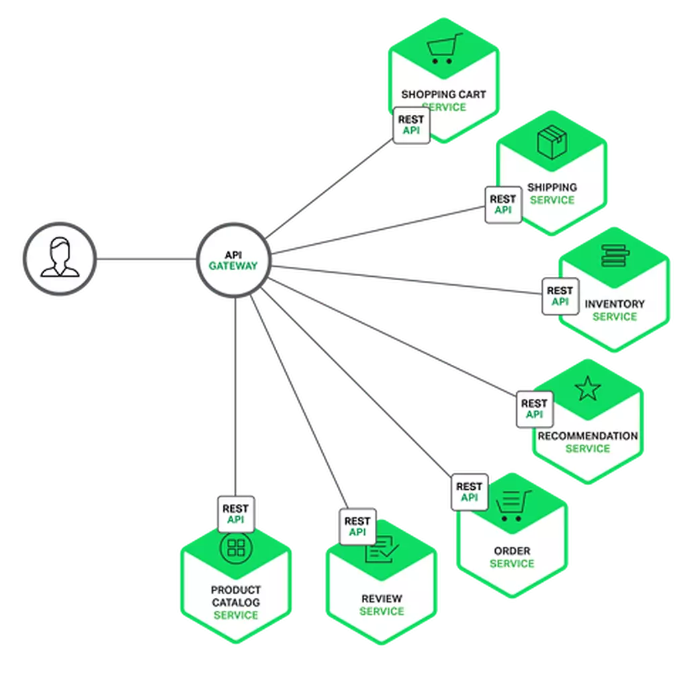
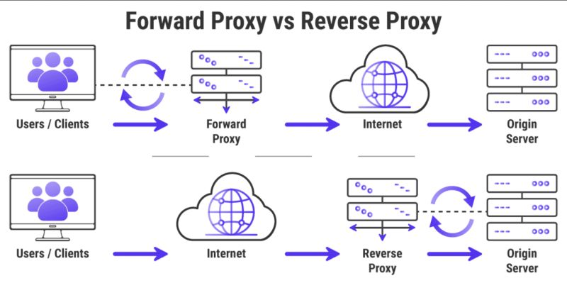

# system-design
# Singleserversetup:

1. Users access websites through domain names, such as api.mysite.com. Usually, the
Domain Name System (DNS) is a paid service provided by 3rd parties and not hosted by
our servers.
2. Internet Protocol (IP) address is returned to the browser or mobile app. In the example,
IP address 15.125.23.214 is returned.
3. Once the IP address is obtained, Hypertext Transfer Protocol (HTTP) [1] requests are
sent directly to your web server.
4. The web server returns HTML pages or JSON response for rendering.

# API(Application Programming Interface)
* is a set of rules, protocols, and tools that allows different software applications to communicate and interact with each other.
* APIs enable integration between different systems, platforms, or services
* Web APIs: Facilitate communication over the internet (e.g., REST, GraphQL, SOAP).
## REST(Representational State Transfer)
* is an architectural style for designing networked applications.
* It defines principles that allow systems to communicate over the internet in a simple and scalable way. REST is commonly used for building web APIs.
## RPC(Remote Procedure call)
* Allows executing procedures or functions on a remote server as if they were local. they serialize very nice
* High-performance services (e.g., gRPC).
* Strongly typed service communication.
## GraphQL
A query language for APIs that allows clients to request exactly the data they need.
## SOAP(simple object access)
XML-based protocol with strict standards.
##  Event-Driven Architecture
Uses message brokers like RabbitMQ, Kafka, or Redis.
## Microservices
Services communicate using REST, gRPC, or messaging systems.
## P2P
Peer-to-peer network, abbreviated as P2P, is a network consisting of a number of computers that are connected to each other through
the Internet using a distributed architecture. Each member of this network is called a node. Nodes are usually defined with the same power and duty. 
Files are shared between network nodes without the need for a central server.
## CQRS(Command Query Responsibility Segregation)
* Commands ==> just do a task and not return any thing
* Queries ==> do a query and return any thing but not change a state
* CQRS stands for Command and Query Responsibility Segregation, a pattern that separates read and update operations for a data store.
*The basic principle of CQRS is to separate commands and queries from what they do. Commands and queries perform very different roles in a system,
 and their separation means that each can be optimized as needed, which can be very useful for distributed systems.
* Well, imagine that you have an online store. When a customer comes and wants to buy a product, this is where the command part comes into action.
 The task of this department is to register the purchase and update the inventory of the products. Now suppose the same customer wants to see or search for more 
 information about the products, this is where the query section comes in and provides the information. In this way, each part does its job and the system works better. 
## SOA(service oriented architecure)
Service Oriented Architecture or SOA is a software development model that allows different services to communicate with each other through different platforms to 
form an application. In SOA, a service is a piece of software designed to perform a specific task.
Service-oriented architecture allows different services to transfer data and execute processes with minimal dependencies.
# API GETWAY

* API Gateway is a user interface that is placed between Client and Service and creates an abstraction level between them. With API Gateway, the Client no longer needs to interact with several services to receive the required data. It sends its request to the API Gateway, and it is the API Gateway that determines which services it should apply to in order to respond to the Client's request, and the services send their response to the API Gateway, and the API Gateway sends the final response to the Client.
* It is responsible for managing and routing requests from clients to the appropriate services, often while adding additional
 functionality like security, load balancing, and analytics.
 * Routing,Authentication and Authorization,Rate Limiting and Throttling,Load Balancing,Protocol Translation,Caching,Request and Response Transformation

 * An API Gateway is a management tool that acts as a single entry point for all client requests to various microservices or APIs in a system.
* Routes HTTP requests (REST, GraphQL, etc.) to appropriate backend services.Authentication,Rate limiting,Load balancing
* Manages REST/GraphQL APIs	,HTTP/HTTPS(Protocol),Request-response,Microservices routing, APIs,	Load balanced API calls


# Socket Gateway
A Socket Gateway is designed to manage real-time, bi-directional communication between clients and backend services using WebSocket or similar protocols.
* Establishes a persistent connection for sending and receiving data in real time.
* Used for event-driven systems where latency is critical
* Multiple Transports,Chat apps,Online multiplayer games,Live stock price tickers.
* Manages WebSocket connections , WebSocket, MQTT(Protocol),Bi-directional, real-time,Real-time communication


# Database
With the growth of the user base, one server is not enough, and we need multiple servers: one
for web/mobile traffic, the other for the database (Figure 1-3). Separating web/mobile traffic
(web tier) and database (data tier) servers allows them to be scaled independently.
1)  Data-tier ==> where the information that is processed by the application is stored and managed. 
## Which databases to use?
You can choose between a traditional relational database and a non-relational database. Let
us examine their differences.
1) Relational databases are also called a relational database management system (RDBMS).SQL DB
• store data in tables and rows
2) Non-Relational databases are also called NoSQL databases. Popular ones are CouchDB,
Neo4j, Cassandra, HBase, Amazon DynamoDB, etc. [2]. These databases are grouped into
four categories: key-value stores, graph stores, column stores, and document stores. Join
operations are generally not supported in non-relational databases.
• Your data are unstructured, or you do not have any relational data.
• You only need to serialize and deserialize data (JSON, XML, YAML, etc.).
• You need to store a massive(large) amount of data.
# Vertical Scaling & Horizontal Scaling:
Vertical scaling (or "scaling up") and horizontal scaling (or "scaling out") are two approaches to improve system capacity and performance. Here’s a breakdown of the two methods:
1. Vertical Scaling (Scaling Up)
*Definition: Increasing the power of a single server or machine by adding more resources (CPU, RAM, storage, etc.).
* Example: Upgrading from a 16 GB RAM, 4-core machine to a 64 GB RAM, 16-core machine.
* Pros:
1) Simpler to implement since you’re just upgrading a single machine.
2) Can be cost-effective for smaller applications and workloads.
3) Easier to manage since there’s only one instance to configure and maintain.
* Cons:
1) Limited by the maximum capacity of the hardware. There’s a ceiling to how much a single machine can scale.
2)  higher cost for powerful hardware.
3) Single point of failure: If the machine goes down, the application becomes unavailable.

2. Horizontal Scaling (Scaling Out)
* Definition: Adding more machines to distribute the workload across multiple servers.
* Example: Adding additional servers to handle the traffic in a web application or distributing database queries across replicas.
* Pros:
1) you can handle with your budget.
2) multiple machines (if one machine fails, others can take over).
3) Cost-effective in the cloud since smaller instances can be added and removed as needed.
* Cons:
1) Adds complexity, as managing multiple servers requires distributed system techniques (like load balancing, database replication, etc.).
2) ‌Increased operational overhead with orchestration, data consistency, and failure handling.
3) Can lead to higher latency if poorly implemented due to the need to synchronize data across multiple nodes.

### Vertical Scaling is often suitable for small to medium applications with low traffic, where adding more power to a single server can handle the load effectively.
### Horizontal Scaling is typically preferred for large applications or systems that need high availability and fault tolerance. Web applications, microservices, and big data systems usually rely on horizontal scaling to meet demand dynamically.
## Hight Traffic ==> 
1) Scalability Horizontal scaling the load across multiple machines.
2) Fault Tolerance and High Availability   With multiple servers in a horizontal setup, the application can remain operational even if one server fails. This redundancy ensures that traffic can still be managed smoothly without a single point of failure.
3) Cost Efficiency in the Long Run orizontal scaling can be more cost-effective for high-traffic applications.
4) Load Balancing: By using a load balancer, you can distribute incoming traffic across multiple servers.
5) Flexibility with Microservices or Distributed Architecture: High-traffic applications often benefit from a microservices or distributed architecture
6) Cache layers (e.g., Redis or Memcached) can be added to reduce database load.


# CA,CP,AP
c-->Consistency , A ---> Availability, P --->  Partition Tolerance
1) Consistency --> This principle is pointing out that if you have several servers and have scaled it horizontally, all content in all servers must be the same. It means that no server is different from another
2) Availability --> This word means that the entire system and servers must always be ready to serve requests and send an appropriate response for each request.
3) Network outage or Partition Tolerance: Here it is saying that if, for example, the power of a server is cut off and there is a disturbance in the network, the system can continue on its way without any problems. Answer your client's needs and requests.
🔵 Choice of CA: Each request receives a valid response.
🔵 CP selection: every time the client receives the information of the latest version.
🔴 AP selection: the system can continue to work during network failure.

🔺👈 Important point: We never have CA in the real world because there is always a network outage.
# Load Balancing
Load balancing is the practice of distributing computational workloads between two or more computers. On the Internet, load balancing is often employed to divide network traffic among several servers. 
https://aws.amazon.com/what-is/load-balancing/
👈 Round Robin Algorithm: In this algorithm, traffic is distributed equally among all available servers. This is a simple and efficient way to distribute the load, but it may lead to load imbalance, especially if the servers have different processing power or workload.
Example: suppose you have a store website that has three servers. With the Round Robin algorithm, the traffic is divided equally between these three servers, just like a waiter who takes turns serving food to different tables.


👈 Weighted Round Robin Algorithm: This algorithm allows you to assign a weight to each server. This weight indicates the share of traffic that each server should receive. This can be useful to ensure that stronger servers receive more traffic.
Example: suppose you have a company that has two servers, a strong server and a weaker server. With the Weighted Round Robin algorithm, you give a stronger server more weight to handle more traffic, just like a more experienced waiter handling more orders.

Least Connections Algorithm: This algorithm sends traffic to the server that has the least number of active connections. This evenly distributes the traffic between the servers and prevents any server from being overloaded.
Example: suppose you have an online chat service that has thousands of users. With the Least Connections algorithm, traffic is sent to the server with the least number of connected users, just like a waiter looking for the table with the fewest customers.

👈 Weighted Least Connections Algorithm: This algorithm is similar to Least Connections, except that it allows you to assign a weight to each server.


Least Response Time Algorithm: This algorithm sends traffic to the server with the fastest response time. This helps ensure users have the fastest experience possible.
Example: Suppose you have an online game that requires fast response time. With the Least Response Time algorithm, traffic is sent to the server with the fastest response time, just like a waiter preparing the fastest order.

👈 Weighted Response Time Algorithm: This algorithm is similar to Least Response Time, except that it allows you to assign a weight to each server.

👈 IP/Hash-Based Algorithm: The IP address of each visitor acts as a "key" and is converted into a number using the hash function. This number is assigned to a specific server on the website and the traffic of that visitor is sent to that server.

# REVERSE AND FORWARD PROXY

The concept of Forward Proxy:

* On the user's side and he is aware of it, something like VPN but with different functionality
* Take care of security and where it goes on the internet.
* It can even set the main address of the user to be anonymous.
* It is useful for organizations to control their employees and the sites they go to.

Concept of Reverse Proxy:

* Behind the server and acts like a protector.
* It takes user requests, sends them to the right server and returns the answer.
* Keeps the identity of the main server secret and increases its security.
* It also helps server performance because it can distribute the load between several servers (load balancing) and keep things that have been requested before (caching) so that it reaches the user faster next time.

In general, the Forward proxy takes care of the user and controls the traffic, while the Reverse proxy monitors the server and starts its work.
# Race Condition
5 months ago

What is the concept of Race Condition? The first question that every hashtag#programmer should be able to answer in hashtag#interview hashtag#recruitment.

🔺🔻 In the world of programming, there is something called "Race Condition". Imagine that two programs (or two parts of a program) like two runners who want to pass through a door, simultaneously want to access and change the same information.

What will happen now? Which one will arrive first? Whichever section arrives first is the winner and does its job. The problem is that in this way it is not at all clear which part will reach this gate first, it is a kind of luck. It may give the same result every time and your program may not work properly.

Suppose two people want to withdraw money from two different ATMs at the same time from a common bank account. Their account has a balance of 10 million tomans and each of them wants to withdraw 6 million tomans. If these two transactions are done exactly at the same time and the bank system does not have a lock, a problem will arise.

Here's how:
- The first ATM shows a balance of 10 million tomans.
- The second ATM also sees a balance of 10 million tomans.
- The first ATM deducts 6 million tomans and updates the balance to 4 million tomans.
- The second ATM also reduces 6 million tomans and updates the balance to 4 million tomans.

Finally, the balance of the account is 4 million tomans, but two to 6 million were withdrawn, which means 12 million tomans were deducted from the account. This means that the bank made a mistake and more money was withdrawn from the account.

To avoid this problem, banks use locking and atomic transactions, which means that each transaction is done separately without interfering with the others. In this way, such a mistake will not happen again.

These competitive conditions can lead to serious financial problems and big disputes. To avoid this problem, banks use locking techniques and atomic transactions to make sure that each transaction is done separately without interfering with other transactions.

# sharding
Let me explain sharding to you simply. Suppose you have a hashtag #online_store with a lot of customer information, orders and products. As the number of users and purchases increases, this amount of information becomes too much for a single server and it cannot handle it well. Here is a cool solution called sharding.

In fact, sharding is a kind of partitioning in which the database is divided into smaller and more convenient pieces called shards. Each shard keeps a part of information and all shards together form the whole database. This makes the whole system faster and more manageable.

👈 Let me give an example so that you understand better:
Suppose you categorized your customers based on their location, for example, North America, Europe and Asia. Each shard keeps the information of customers of a specific area. For example:

- First Shard or Shard 1: North America (including customer information, orders and products of North American customers)
- Second shard or Shard 2: Europe (including customer information, orders and products of European customers)
- The third shard or Shard 3: Asia (including customer information, orders and products of Asian customers)

When a user enters the site, the system selects the appropriate shard for the query based on the location or other factors. For example, if a user enters from Europe, the system sends all requests related to that user to the European shard.

With sharding, you divide the entire workload between several servers and make everything faster and more manageable. Each shard works separately and you can expand the system whenever you want by adding more shards (horizontal scaling). In addition, if one shard encounters a problem, the rest of the shards will not be affected and the whole system will continue to work.

👈 Another example of sharding that is not related to geography can be to categorize information based on data type. For example:

- Shard 1 or Shard 1: including all information related to customers, such as name, email, address and phone number
Shard 2: includes all information related to orders, such as order date, purchased items, price and payment details
Shard 3 or Shard 3: includes all information related to products, such as product name, description, price, images and inventory.

With this method, we can assign each shard to a separate server and manage and optimize each type of data independently.

For example, the shard related to clients can be assigned to a server with high speed and a lot of memory so that it can quickly respond to queries. While the shard related to products can be assigned to a server with more storage space so that it can store a large amount of images and information related to products.

This method can significantly improve the performance and scalability of the database, especially for systems that store large amounts of different data.

be a handful
# Caching
Caching is a technique that is used to improve the performance and increase the scalability of systems. In caching, the data that is used the most is stored in a faster memory (such as hashtag#RAM) so that they can be accessed faster. These caching techniques are very common in the world of hashtag programming.

👈 1. Cache-Aside method
- In this method, the program must put the data in the cache by itself.
- If the data is not in the cache, the program takes the database from the hashtag# and puts it in the cache for "next use".
- This method is more useful when most of the system load is on the reader and the data does not change much.

🔺 For example, the profile page of users:

```def get_user_profile(user_id):

 profile = cache.get(f"user_profile:{user_id}")

 if profile is None:
 profile = database.get_user_profile(user_id)
 cache.set(f"user_profile:{user_id}", profile)
 return profile
```

👈 2. Read-through method
- In this method, the cache is like an intermediary between the program and the database and receives read requests.
- When you want data, the cache first checks if it has it and gives it, if it doesn't have it, it takes it from the database and stores it in the cache, and then sends it.
- This method makes programming easier because the cache itself does the work of receiving and storing data.

🔺 For example, receiving product information:

```product_details = cache.get(f"product_details:{product_id}")
return product_details
```

👈 3. Write-through method
- In this method, both reading and writing operations are done through cache.
- When you "add or update" data in the database, it is stored in the cache at the same time.
- This method ensures that the cache and database are always in sync, but it may be slower due to writing data twice.

For example, product inventory management:

```def update_stock_level(product_id, new_stock_level):
 database.update_stock_level(product_id, new_stock_level)
 cache.set(f"stock_level:{product_id}", new_stock_level)
```
👈 4. Write-Around method
- In this method, the write operation is performed directly in the database and bypasses the cache.
- The first reading operation checks the cache, if there is no data, it takes it from the database and stores it in the cache.
- This method reduces the load of writing from the cache and is suitable for when you write a lot of data.

🔺 For example, updating or adding blog posts:

```def update_blog_post(post_id, content):
 database.update_blog_post(post_id, content)

def get_blog_post(post_id):
 post = cache.get(f"blog_post:{post_id}")

 if post is None:
 post = database.get_blog_post(post_id)
 cache.set(f"blog_post:{post_id}", post)

 return post
```
👈 5. Write-Back method
- In this method, you first write the data in the cache and then write it to the database asynchronously.
- This method can increase the writing speed and reduce the delay, but if the cache is destroyed before writing to the database, there is a risk of data loss.

For example, user analytics:

def log_user_activity(user_id, activity):

 cache.set(f"user_activity:{user_id}", activity)
 schedule_async_db_write(user_id, activity)

def schedule_async_db_write(user_id, activity):

 database.write_user_activity(user_id, activity)
# DDD
In software engineering, "Domain Driven Design" (DDD) is a design method introduced by Eric Evans. The goal of this method is to create a common understanding of the work area between programmers and strategists

Key concepts

Domain: The part where the user uses the program. For example, if our program is an online book store, its scope is the same.

Domain Model: An abstract model that shows the concepts, rules and logic of the work domain. This model should be such that both technical experts and strategists can understand it.

Common language (Ubiquitous Language): A common language that the team uses to express all the words and concepts in the project. This language fills the gap between technical and specialized terms.

Bounded Context: A boundary within which a specific model is defined and used. This helps manage complexity and divides the domain into smaller, more manageable parts.

Entities: Objects that have a specific and fixed identity and can have different states.

Value Objects: Objects that describe certain aspects of the domain but do not have a specific identity.

Aggregates: are a cluster of domain objects that can be considered as a unit. Don't worry, I will give you an example so you can understand.

Repositories: Mechanisms for storing, retrieving and searching objects that act like a collection of objects.

Services: Operations or processes that are not related to the Life Cycle of an Entity or Value Object.

Practical example: online book store

Let's explain these concepts with an example from an online book store.

Domain:
The domain is the "online book store" that focuses on the business logic of buying, selling and managing books.

Domain Model:
The domain model includes entities such as book, customer, order and concepts such as inventory management and payment processing.

Ubiquitous Language:
- Book: It is the same product we are selling.
- Customer: the person who buys books.
- Order: Customer purchase that includes one or more books.
- Inventory: the number of available books.
- Payment: transaction for an order.

Bounded Context:
1. Sales context: including inventory and order taking and payment processing.
2. Inventory context: including entities and book inventory management.
3. Customer context: including entities and information and customer profiles.

Entities and Value Objects

- Entities:
 - Book (ISBN, Title, Author, Price)
 - Customer (ID, Name, Email)
 - Order (ID, Book Items, total amount, order date)

- Value Objects:
 - Address (street, city, province, postal code)
 - money (amount, currency)

Aggregates

- Order set: Order entity is a root Aggregate. including the list of books as a Value object and the total amount as a value object.
- Customer collection: Customer entity is a root Aggregate. Contains the address as a Value object.

Repositories
- Book repository: managing book entities, finding, saving and deleting books.
- Order repository: managing order entities, registering, tracking and retrieving orders.

Services
- Order service: includes the logic of order registration, including inventory checking, payment processing and order confirmation.
- Inventory service: including the logic of updating the inventory level, checking the inventory and renewing the inventory of books.

# gRPC
Let's learn gRPC very simply:

What does gRPC mean?

The gRPC structure is a kind of technology and tool for programmers that helps two different programs or services to talk to each other, even if they are on different servers. It seems that these two programs are talking to each other in the same room, but in reality each of them is in a different city.

✳️ How does it work?

Suppose we have two programs, one that wants to do a certain task and another that is going to do that task for him:

1. Definition of tasks:
 - First of all, we must define what needs to be done. For example, program A wants to ask program B "What is my name?" And program B should answer "Your name is so-and-so."

2. We set up communications:
 - We need to specify a communication method, how these two programs should talk to each other. Here we use gRPC, which is a kind of common language for communication between these programs.

3. Generation of communication codes:
 - gRPC itself automatically generates codes so that these programs can easily communicate with each other. These codes remain like bridges that establish communication between the two parties.

4. Service execution:
 - Now program B, which is supposed to answer, starts a service and listens to the call until it answers when program A asks it.

5. Service call:
 - Program A comes and asks its question through these communication bridges built by gRPC and program B answers it.

Why is gRPC good?

1. Fast and efficient:
 - gRPC itself is very fast and uses advanced methods to send and receive data, which makes communication fast and without delay. In fact, compression due to the method of sending data (a kind of zipping) makes it send the information very quickly.

2. Support for different languages:
 - With gRPC, you can connect programs written in different programming languages. For example, a program with hashtag #Python and a program with hashtag #Java.

3. Reduce additional codes:
 - gRPC itself generates the necessary codes for communication and there is no need for programmers to write these codes themselves, which makes errors less and things go faster.

4. Streaming:
 - The gRPC tool can send and receive data continuously and sequentially, which is very useful for applications that need to constantly send and receive data, such as video streams.

5. Compatibility and compatibility:
 - gRPC services work easily together and you don't need to worry about different incompatibilities.

In general, gRPC is a great tool for different programs and services to communicate easily and at high speed, even if they use different languages ​​and technologies.
# SERVERLESS
Serverless is a cloud computing model in which developers can run their own code without managing and maintaining servers. This model allows developers to focus more on writing code and developing applications and get rid of the hassles of managing servers.

In fact, in the Serverless model, cloud service providers such as AWS, Azure and Google Cloud take responsibility for infrastructure management and you only run your code in their environment. That way, you only pay for the resources you actually use, and you don't need to anticipate and buy additional servers.
## Type Of Load Balancing:
1) DNS load balancing: 
 you configure your domain to route network requests across a pool of resources on your domain. A domain can correspond to a website, a mail system, a print server, or another service that is made accessible through the internet. DNS load balancing is helpful for maintaining application availability and balancing network traffic across a globally distributed pool of resources. 